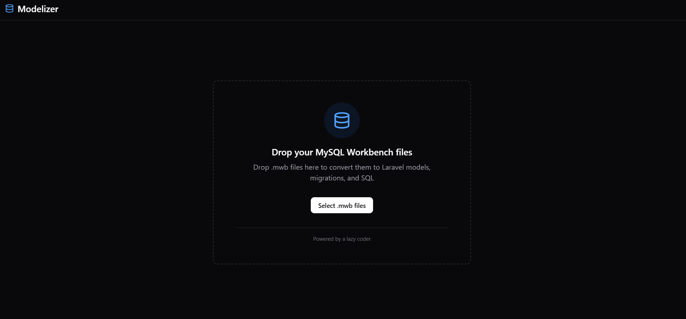
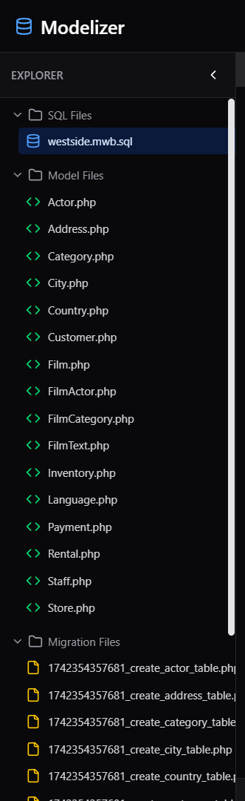
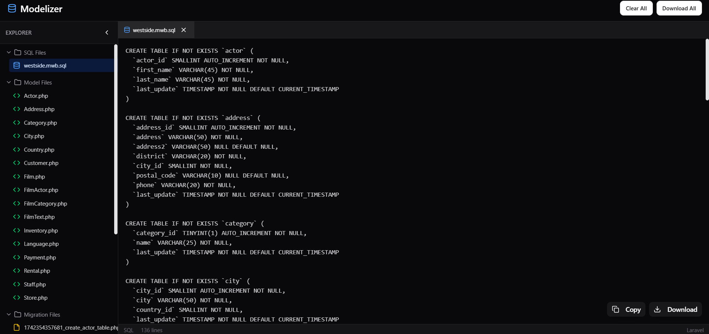

# gen-model



## Overview

This project converts MySQL Workbench (`.mwb`) files into SQL queries, models, and migrations for Laravel. It provides a simple drag-and-drop interface where users can upload their `.mwb` file, and the tool automatically generates the respective SQL schema, Eloquent models, and Laravel migrations.

## Features

- **Drag and Drop Support**: Simply upload your `.mwb` file, and the system takes care of the rest.
- **Auto-Generation**: No need to manually create SQL queries or Laravel migrations.
- **No AI Involvement**: The process follows a deterministic approach to ensure accuracy.

## Installation

1. Clone the repository:
   ```bash
   git clone https://github.com/sk1ees/gen-model.git
   cd gen-model
   ```
2. Install dependencies:

   ```
   npm install && npm run dev
   ```

## Usage

1. Open the application in your browser.
2. Drag and drop a `.mwb` file onto the interface.
3. The tool will process the file and generate:

   - SQL Queries
   - Laravel Eloquent Models
   - Laravel Migrations

   

4. Copy or download the generated files as needed.
   

## Contributing

Feel free to fork this repository and submit pull requests with improvements or bug fixes.

## License

This project is licensed under the MIT License.
